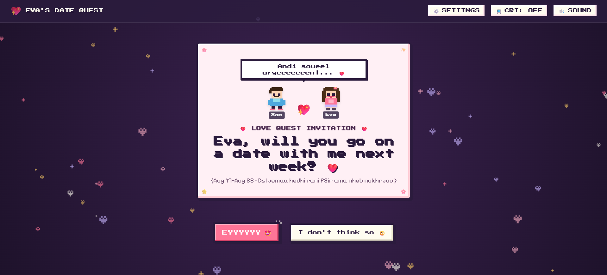
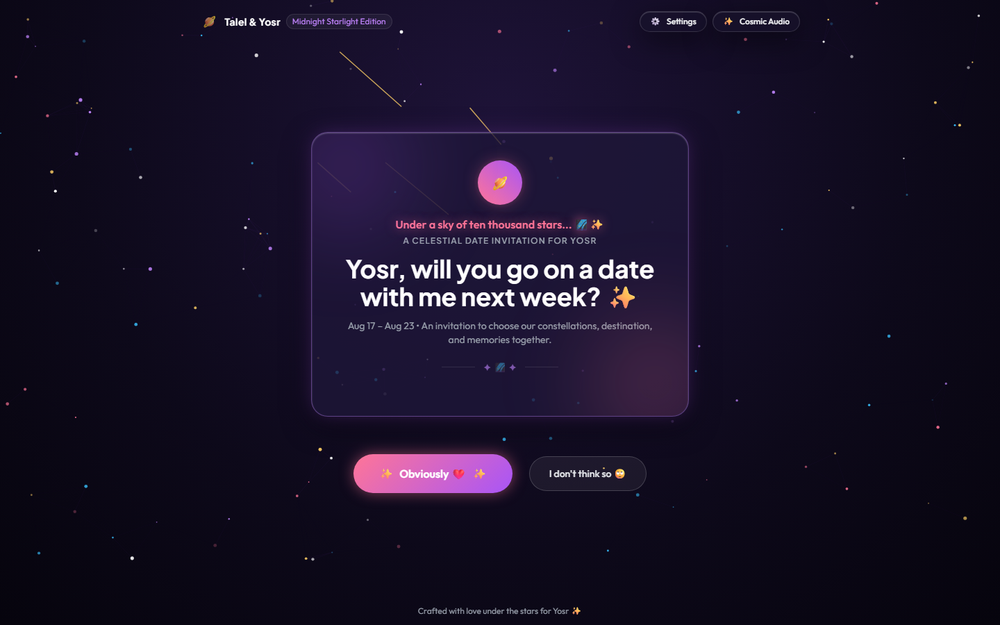
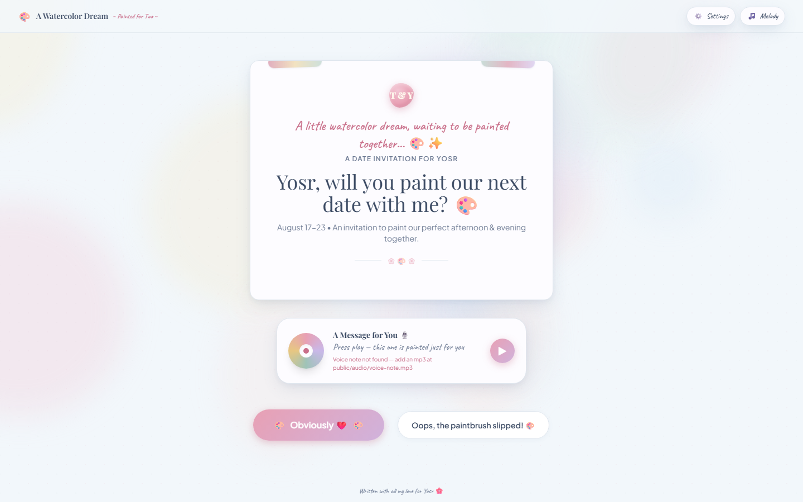
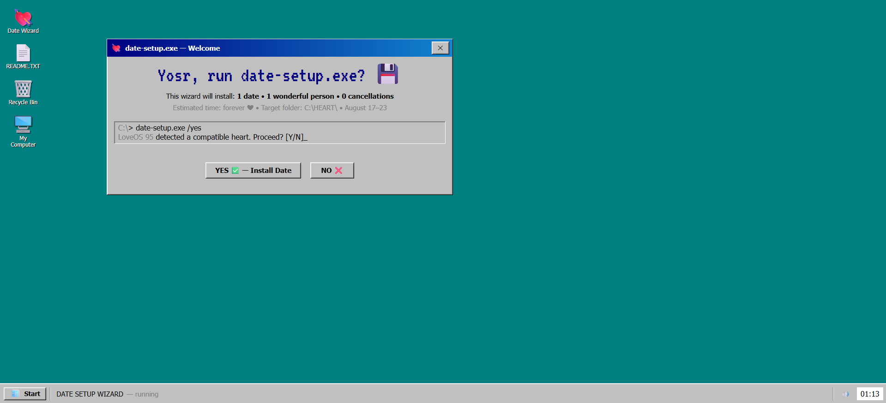
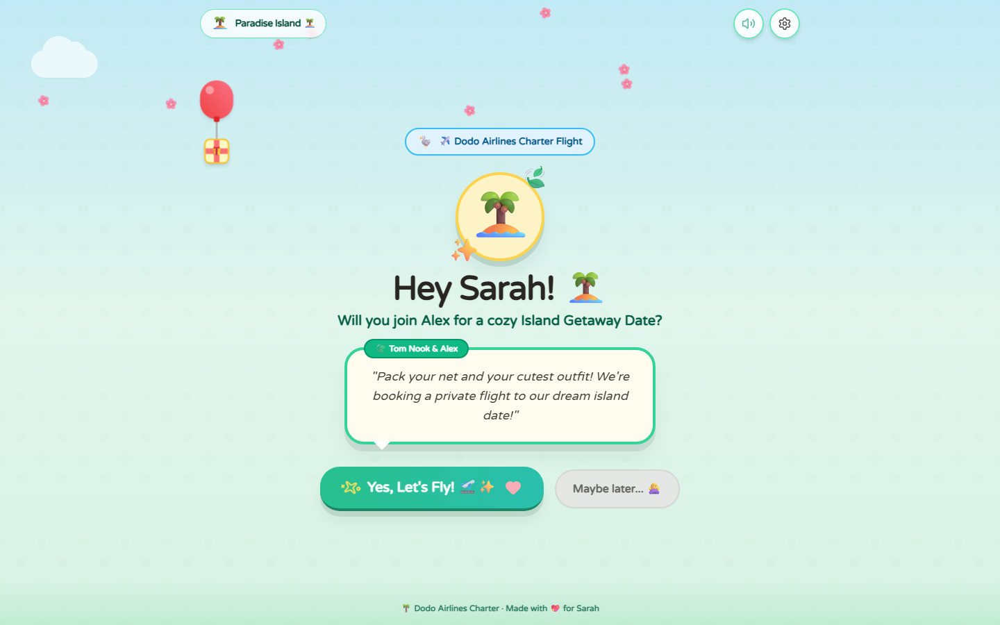
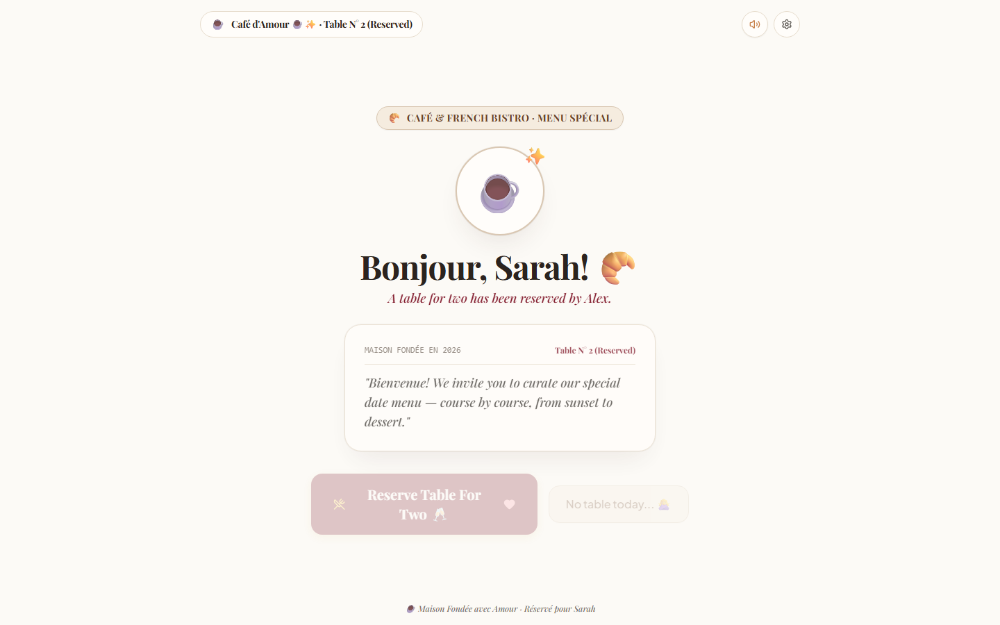

# Pixel Art Date Website 🎮❤️

This repo has 8 versions of a "plan our date" website. She picks the day, time, activities, place, drink, and greeting. When she confirms, the full plan is emailed to you.

Each version is its own **React 19 + TypeScript + Vite + Tailwind + Framer Motion** project with its own config file (`src/config/appConfig.ts`). Clone it, edit one file, build it — done.

## Versions

| Version | Folder | What it looks like |
|---|---|---|
| Retro RPG | `retro style/` | An 8-bit quest with items, XP... |
| Midnight | `midnight style/` | Stars and night sky theme and a downloadable VIP pass |
| Storybook | `storybook style/` | An old paper storybook with chapters and invitation card included |
| Watercolor | `watercolor/` | Soft pastel colors and calm text. Plays your voice note like a record player |
| Windows 95 | `win95 style/` | A fake "date-setup.exe" installer: boot screen, windows you can drag and multiple easter eggs |
| Date Mixtape | `mixtape/` | A cassette tape: spinning reels, play / rewind / fast-forward buttons and a tracklist for the date (unstable) |
| Island Getaway | `island style/` | Animal Crossing style flight trip and a downloadable Boarding Pass |
| Café & Bistro | `cafe style/` | A French café menu: pick items like ordering food, get a printed receipt at the end |

**Please note:** **Midnight**, **RetroRPG**, **Win95**  are the only stable versions right now. The Café and Mixtape versions were purely vibe-coded and still need some changes and fixes — expect a few rough spots.

## Screenshots 📸

### 🎮 Retro RPG


### 🌌 Midnight


### 🎨 Watercolor


### 🖥️ Windows 95


### 🏝️ Island Getaway


### ☕ Café & Bistro


## Quick Start (Super simple)

```bash
cd "retro style"      # or "midnight style" / "storybook style" / "watercolor" / "win95 style" / "mixtape" / "island style" / "cafe style"
npm install
npm run dev          # start the local server
npm run build        # production build → dist/
npm run preview      # preview the build
```


## Customize — edit one file

Every version gets its text from one single file: `src/config/appConfig.ts`. No coding knowledge needed.

How to make it yours:

1. Open the version's folder → `src/config/` → open `appConfig.ts` with any text editor (Notepad works).
2. Change only the words between `"quotes"`.
3. Save, run `npm run dev`, and watch your changes live.

What you can change:

- **Names** — yours and hers (appears in titles, letters, downloaded files)
- **Dates** — the 7 days she can choose from
- **Choices** — time slots, activities, places, drinks, greetings
- **Texts** — the "NO" button jokes, the secret love letter, cover text
- **Your email** — where the confirmed plan gets sent

If you break something by accident, don't panic — the build will fail and tell you exactly which line to fix.

## Deployment

Right now I highly suggest using **[Netlify](https://www.netlify.com)** — simple and quick.

`npm run build` creates a static site in `dist/`, so any static host works too (Vercel, GitHub Pages, etc.).

## The Email Feature ⚙️

When she confirms the date, the plan is emailed through [FormSubmit](https://formsubmit.co):

- She clicks the ⚙️ **Settings** button to enter your email (saved on her device).
- If no email is set, the settings window opens by itself before confirming.
- **First time only:** FormSubmit sends you a one-time activation link. Click it once and future emails arrive normally.
- The sending code is in `src/utils/emailService.ts`.

  **Please note:** These steps/options won't be needed if you set up the config file `appConfig.ts` correctly and filled in the email column.

## Voice Note 🎙️ (watercolor)

The watercolor version can play a personal voice message:

> ⚠️ This feature is still under construction and may not work perfectly yet.

1. Save your recording as `watercolor/public/audio/voice-note.mp3`.
2. That's it — the record player appears by itself.
3. To hide it, open `watercolor/src/config/appConfig.ts` and set `voiceNote.src` to `''`.

## Roadmap 🚧

- This project is still being worked on — expect hotfixes, updates, and new styles for everyone.
- **Next big thing:** a platform to host all the styles. The sender will pick a style and generate a link to send to the receiver — no code editing needed. That will make things much easier for new users.

## Project structure (same in every version)

```
src/
├── config/appConfig.ts        ← the only file you need to edit
├── components/                ← screens and UI parts
├── utils/emailService.ts      ← sends the email
├── types.ts                   ← types
└── App.tsx                    ← main app logic
```

